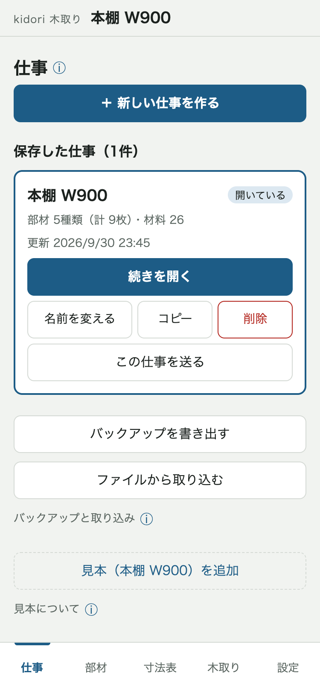
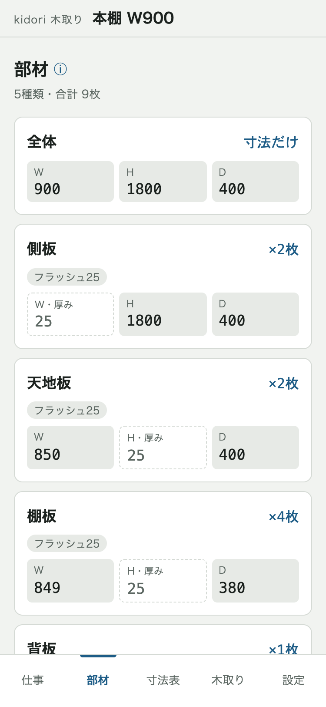
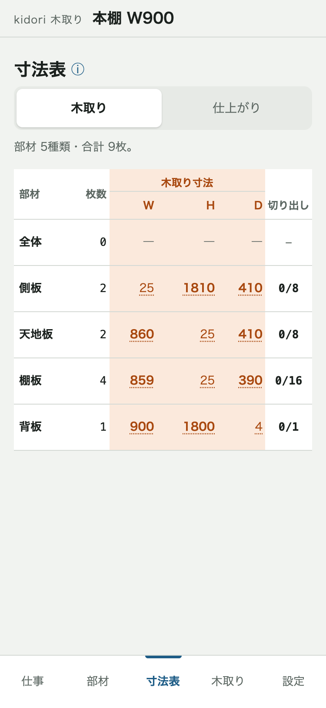
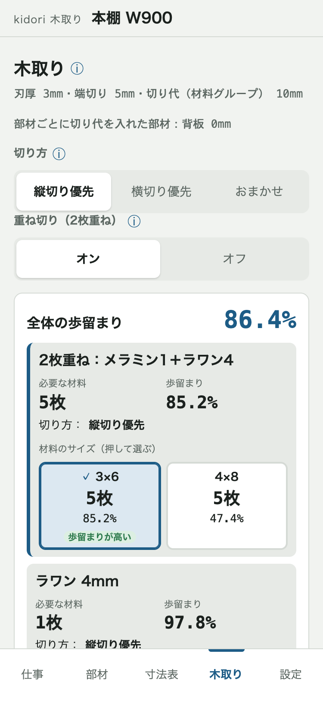
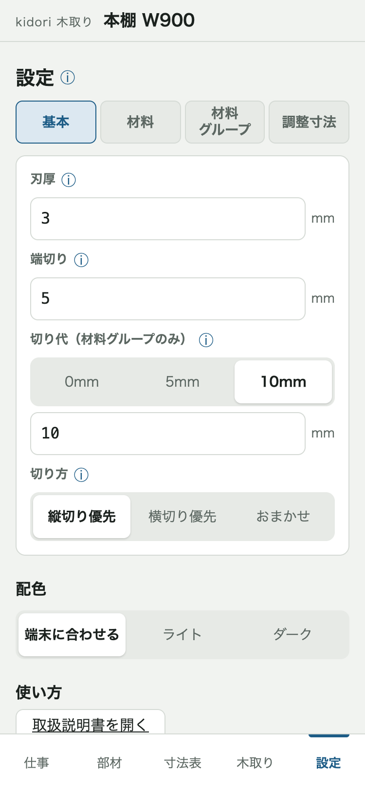

# kidori 取扱説明書

最終更新：2026-09-30（第2.9版）

---

## 1. このアプリでできること

部材の寸法を入れると、どの材料を何枚使い、どう切ればよいかが出ます。
スマホのブラウザ（iPhone は Safari、Android は Chrome）で `https://kobayashikenpa.github.io/kidori/` を開いて使います。

**ホーム画面に追加**しておくと、アイコンからすぐ開けます。

- iPhone：Safari の共有ボタン（四角から上向きの矢印）→「ホーム画面に追加」→「追加」
- Android：Chrome の右上の「︙」→「ホーム画面に追加」（または「アプリをインストール」）
- 保存したデータは、ホーム画面のアイコンと Safari で別々になることがあります。いつも同じほうから開いてください

---

## 2. 5つの画面の役割

画面の下の「仕事」「部材」「寸法表」「木取り」「設定」を押して、画面を移ります。

### 仕事

家具1台（1件の注文）ごとの入力を、1つの「仕事」としてまとめて保存します。作った仕事はここから開きます。

### 部材

切り出すパーツ（側板・天地板・棚板など）の名前・材料・寸法・枚数を入れます。

### 寸法表

部材の寸法を一覧で見ます。

### 木取り

必要な材料の枚数と、切り方の図（配置図）を見ます。切った部材にはここでチェックを付けます。

### 設定

刃厚・端切り・材料などを決めます。最初はそのままで使えます。

---

## 3. 最低限の手順

例として、ラワン 18mm の側板（W 18・H 1800・D 400）を2枚取ります。

1. 家具1台分をまとめるために、「仕事」で「＋ 新しい仕事を作る」を押す
2. 名前（例：本棚 W900）を入れて「作って開く」を押す（部材の画面が開きます）
3. 部材を足すために、「＋ 部材を追加」を押す
4. 次の欄を入れる
   - 「名前」：側板
   - 「枚数」：2
   - 「材料」：「ラワン」を押し、厚みの［18］を押す
   - 「W」「H」「D」：欄を押し、出てきたボタンで数字（18・1800・400）を入れて「完了」を押す
5. 「追加する」を押す。部材の数だけ 3〜5 をくり返す
6. 材料の枚数と切り方を見るために、「木取り」を押す
7. 切り終わったら、その1枚の配置図の下の「切り出しチェック」で、切った部材の行（例：「□ 側板 ×2枚」）を押す

まず試したいときは、「仕事」の「見本（本棚 W900）を追加」を押すと、部材が入った仕事ができます。

---

## 4. 困ったら

- 見出しや欄の横の「ⓘ」を押すと、その場所の説明が出ます。
- データはこのスマホの中に自動で保存されます（ほかのスマホとは共有されません。ブラウザのデータを消すと消えます）。ときどき「仕事」の「バックアップを書き出す」でファイルに残してください。

---

## 5. 画面ごとの言葉と機能

### 仕事

- **＋ 新しい仕事を作る**：新しい仕事を作ります。新しい仕事は、いつも最初の設定から始まります。
- **開く／続きを開く**：その仕事を開きます。いま開いている仕事には「開いている」と出ます。
- **名前を変える**：仕事の名前を直します。
- **コピー**：同じ内容の仕事をもう1つ作ります（設定も元のまま）。似た家具を作るときに使います。
- **削除**：仕事を消します。元に戻せません。
- **この仕事を送る**：その仕事をファイルにして、LINE などで職場の人に送ります（切り出しチェックは送られません）。
- **バックアップを書き出す**：全部の仕事を1つのファイルにします。新しいスマホに移すときや、もしものときの備えに使います。
- **ファイルから取り込む**：送られてきた仕事や、バックアップのファイルを選んで取り込みます。今の仕事は変わらず、新しい仕事として足されます。
- **見本（本棚 W900）を追加**：フラッシュ25 の側板・天地板・棚板と、ラワン4 の背板が入った本棚の仕事を作ります。試したいときだけ使い、あとで削除できます。

### 部材

- **部材のカード**：押すと直せます。直したら「保存する」を押します。消すときは「この部材を削除」。
- **W・H・D**：組み立てたときの 幅・高さ・奥行き です。
- **枚数**：何枚切り出すか。0 にすると切り出さない「寸法だけ」の行になります（例：家具の外寸だけを持つ「全体」）。
- **材料**：材料名（例：ラワン）→ 厚み（例：［4］）の順に押して選びます。材料グループは「材料グループ」→［フラッシュ25］のように選びます。
- **［設定］（材料の欄の横）**：設定の画面が重なって開き、材料を足せます。閉じると書きかけの部材に戻ります。
- **材料グループ**：材料を組み合わせたもの（例：フラッシュ25 ＝ 芯材15×1 ＋ メラミン1×2 ＋ ラワン4×2）。厚みは中身の合計で、中身ごとに木取りします（芯材のような「木取りしない」材料は除きます）。
- **厚み**：W・H・D のうち、材料の厚みにあたる寸法。ふつうは自動で決まり、カードに「W・厚み」のように出ます。材料の厚みと合わないと「厚みが合わない」と出て、保存できません。
- **式**：寸法は、ほかの部材の寸法を使った式でも入れられます。例：天地板の W は「全体」→「W」→「−」→「側板」→「W」→「×」→「2」で、欄の上に「仕上がり 850」と出ます。全体の W を変えると、ついて変わります。
- **式のボタンのタブ（部材・厚み・調整寸法）**：［部材］はほかの部材の寸法、［厚み］は材料の厚み（例：フラッシュ25。材料を変えても式がついてきます）、［調整寸法］は逃げ1・ほぞ15 などを入れます。
- **1字消す／全部消す／完了**：式の直前の1つを消す／式を全部消す／入力を閉じる。
- **調整寸法**：逃げ・ほぞなど、式の中で足し引きする寸法です（例：棚板の W ＝ 天地板.W − 逃げ1）。
- **木目**：部材の木目をどの方向に通すか（例：H方向）。「どちらでもよい」なら回して置けます。
- **切り代**：空欄なら設定の切り代を使います。その部材だけ変えたいときに入れます（例：背板を 0）。
- **メモ（任意）**：切り出したあとの加工など（例：切り出したあとに穴あけ）。寸法表にも出ます。
- **材料が未設定／式のエラー**：カードに出る印。部材を開いて、材料や式を直します。

### 寸法表

- **［木取り］**：木取り寸法の一覧です（最初はこちら）。
- **木取り寸法**：パネルソーで切る寸法。仕上がり寸法に切り代を足したものです（例：フラッシュ25 の側板 H 1800 → 1810）。厚みには足しません。
- **切り出し**：［木取り］の右の列。切った数/全部の数（例：0/8）。材料グループの部材は中身ごとに数えるので、フラッシュ25 の側板2枚なら 8 になります。
- **［仕上がり］**：仕上がり寸法の一覧です。
- **仕上がり寸法**：家具として仕上げたときの寸法です。
- **完了**：［仕上がり］の右の列。仕上げが終わった部材を押すと、行がグレーになります。
- **数字を押す**：寸法の内訳が出ます（例：全体.W 900 − 側板.W 25 × 2、仕上がり 1800 ＋ 切り代 10）。

### 木取り

- **刃厚・端切り・切り代の表示**：いまの設定です。変えるときは設定の画面で変えます。
- **切り方**：縦切り優先（先に長手方向に長く切る）／横切り優先（先に妻手方向に切る）／おまかせ（必要な材料が少ないほう）。
- **重ね切り（2枚重ね）**：材料グループの部材で、違う材料（例：メラミン1＋ラワン4）を2枚重ねて1回で切ります。「オン」「オフ」で切り替えます。重ねた組は「2枚重ね：メラミン1＋ラワン4」の行で、一番上に出ます。
- **重ねていません（重ねると材料が増えるため）**：重ねると材料が増えるので重ねなかった組です。その行の「3×6」などを押して、重ねられるサイズにするとまた重ねます。
- **歩留まり**：材料の面積のうち、部材に使えた割合です。「全体の歩留まり」は全部の材料の合計です。
- **必要な材料**：その材料が何枚いるかです。
- **材料のサイズ（押して選ぶ）**：「3×6」「4×8」を押して選びます。ボタンに枚数と歩留まりが出て、「枚数が少ない」「歩留まりが高い」も出ます。「部材が収まらない」はそのサイズでは入らない部材がある印です。
- **自由入力（手持ち）**：手元にある材料で木取りします。「＋ 手持ちを足す」でサイズと枚数を入れます。行には「採用」「◯枚採用」「不採用」と出ます。
- **足す**：手持ちが足りないとき、「4×8 を 1枚 足すと入ります」のように出ます。「足す」を押すと手持ちに足します。
- **端材**：重ねた板の余りです。ほかの部材を取るのに先に使います。
- **使う端材／足りない分**：端材を使う材料は「自由入力」が選ばれた表示になり、使う端材と、足りない分（例：4×8 1枚）が出ます。「3×6」「4×8」を押すと、足りない分のサイズが変わります。手元の材料を使うときは「手持ちを入れる」を押します。
- **使わない端材**：使わない端材は「使わない端材 ◯枚」の1行にたたまれ、押すと開きます。
- **配置図**：材料の上に部材を並べた図です。部材は右上から詰め、寸法は木取り寸法です。「1枚目 / 5枚」のように番号が付き、重ねて切る1枚は「重ねた板1」と出ます。
- **切り出しチェック**：配置図の下の行（例：「□ 側板 ×2枚」）を押すと、その1枚の同じ部材がまとめてチェックされます。もう一度押すと外れます。最初のチェックで、その1枚の並びは固定され、あとで部材を変えても変わりません。
- **残りの材料**：チェックを付けた1枚に、まだ残っている材料の大きさです。
- **切り終わり**：全部チェックした1枚は「切り終わり ◯枚」にたたまれます。押すと開いて、チェックを外せます。
- **部材ごとの進み具合**：部材ごとに 切った数/全部の数（例：4/8）。全部切ると「切り終わり」と出ます。
- **お知らせ：材料を減らせます**：切り代や端切りを小さくすると材料が減るときに出ます。設定は自動では変わりません。
- **材料に収まらない部材**：どう回しても材料に入らない部材です。寸法か材料を見直します。
- **計算から外した部材**：材料が未設定・式のエラーなどで、木取りに入らなかった部材です。部材の画面で直します。
- **部材が変わっています**：チェックを付けた1枚の部材を、あとで変えたときに出ます。作り直すときは、その1枚のチェックをすべて外します。

### 設定

設定はこの仕事だけに効きます。上の［基本］［材料］［材料グループ］［調整寸法］で切り替えます。

- **刃厚**：1回切るごとに刃で削れて消える幅（最初は 3mm）。
- **端切り**：最初に材料の端を切り落として矩を出す幅（刃厚を含む。最初は 5mm）。
- **切り代（材料グループのみ）**：あとで削り仕上げるための余分（最初は 10mm）。材料グループの部材だけに足します。
- **切り方**：木取りの画面と同じ、縦切り優先／横切り優先／おまかせ。
- **配色**：端末に合わせる／ライト／ダーク。
- **取扱説明書を開く**：この説明書を開きます。
- **材料**：材料名と厚みで区別します（例：ラワン 4mm）。ラワン・シナ・ポリ・メラミンが最初から入っています。
- **厚みのボタン／［＋］**：厚みのボタン（例：ラワンの［2.5］）を押すと直せます。その材料名に厚みを足すときは［＋］。
- **＋ 材料名を追加／選んで削除**：［材料］の一番下にあります。新しい材料名を足す／いくつか選んでまとめて消す。
- **木取りしない**：芯材のようにパネルソーで切らない材料に付けます。厚みの計算には使いますが、木取りには入りません。
- **材料グループの追加**：初めの形（フラッシュ／ベタ／空）を選んで作ります。「＋ 中身を足す」で足した行は枚数が空欄なので、枚数を入れてから「追加」を押します。
- **調整寸法**：逃げ0.5・逃げ1 が最初から入っています。ほぞ15 などを名前と寸法で足せます。名前や寸法を変えると、使っている式もついてきます。
